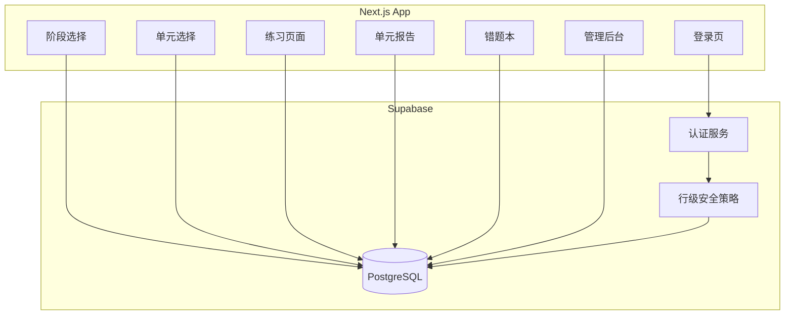
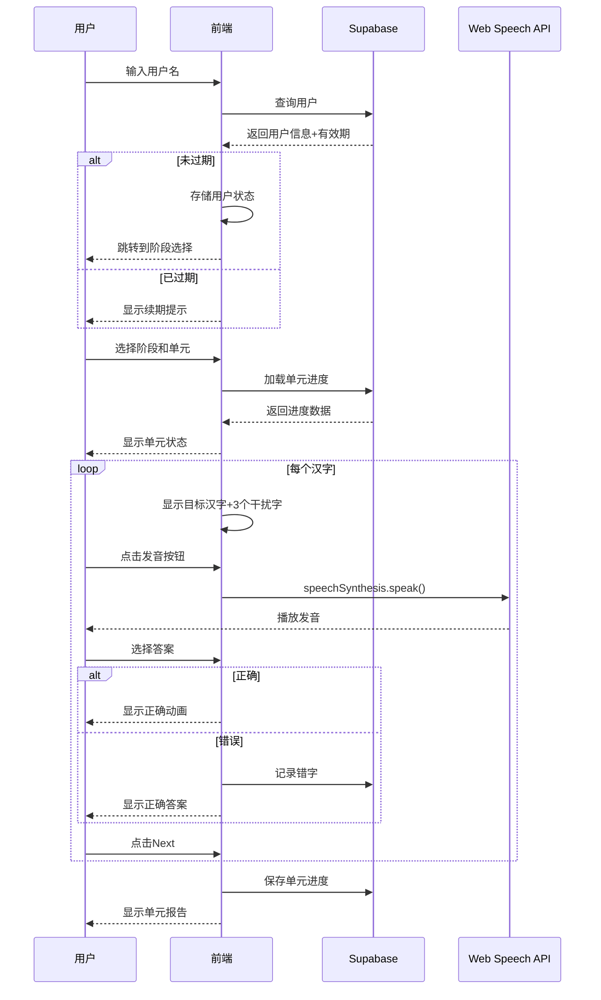

## 产品概述

一个面向儿童的中文识字测试Web应用，通过游戏化的方式帮助孩子巩固识字能力。支持多用户使用，每个用户可以按阶段、按单元进行识字练习，系统会记录学习进度和错字情况。

## 核心功能

### 用户端功能

1. **用户登录**：仅输入用户名即可登录（无密码，适合儿童）
2. **阶段选择**：展示4个学习阶段，显示每个阶段的进度
3. **单元练习**：每单元20个字，按顺序展示目标汉字 + 3个干扰字，通过发音按钮辅助识别
4. **即时反馈**：选择正确继续下一个，选择错误高亮显示正确答案
5. **单元报告**：每单元结束后显示得分、正确率、错字列表
6. **错题本**：按单元分组展示所有错字，支持针对性复习
7. **进度追踪**：可视化展示已完成的单元和当前进度

### 管理端功能

1. **简单密码保护**：通过密码进入管理后台
2. **用户管理**：添加/编辑/删除用户，设置用户名和有效期
3. **使用期限控制**：过期用户无法使用，显示续期提示

## 技术栈选择

- **前端框架**：Next.js 14 (App Router) + TypeScript
- **样式方案**：Tailwind CSS + Framer Motion（动画）
- **数据库**：Supabase (PostgreSQL + Auth)
- **语音合成**：Web Speech API
- **状态管理**：Zustand
- **部署**：GitHub + Vercel

## 实现方案

### 数据模型设计

```sql
-- 用户表
CREATE TABLE users (
  id UUID PRIMARY KEY DEFAULT gen_random_uuid(),
  username VARCHAR(50) UNIQUE NOT NULL,
  expire_at TIMESTAMPTZ,
  created_at TIMESTAMPTZ DEFAULT NOW(),
  is_active BOOLEAN DEFAULT TRUE
);

-- 单元进度表
CREATE TABLE unit_progress (
  id UUID PRIMARY KEY DEFAULT gen_random_uuid(),
  user_id UUID REFERENCES users(id) ON DELETE CASCADE,
  stage INT NOT NULL CHECK (stage BETWEEN 1 AND 4),
  unit INT NOT NULL CHECK (unit >= 1),
  current_index INT DEFAULT 0,
  completed BOOLEAN DEFAULT FALSE,
  score INT DEFAULT 0,
  total INT DEFAULT 20,
  wrong_chars TEXT[] DEFAULT '{}',
  completed_at TIMESTAMPTZ,
  UNIQUE(user_id, stage, unit)
);

-- 错字记录表
CREATE TABLE wrong_chars (
  id UUID PRIMARY KEY DEFAULT gen_random_uuid(),
  user_id UUID REFERENCES users(id) ON DELETE CASCADE,
  char CHAR(1) NOT NULL,
  stage INT NOT NULL,
  unit INT NOT NULL,
  wrong_count INT DEFAULT 1,
  last_wrong_at TIMESTAMPTZ DEFAULT NOW(),
  UNIQUE(user_id, char)
);

-- 管理员密码配置表
CREATE TABLE admin_config (
  id INT PRIMARY KEY DEFAULT 1,
  password_hash VARCHAR(255) NOT NULL
);

-- 索引优化
CREATE INDEX idx_unit_progress_user ON unit_progress(user_id);
CREATE INDEX idx_wrong_chars_user ON wrong_chars(user_id);
CREATE INDEX idx_wrong_chars_user_stage_unit ON wrong_chars(user_id, stage, unit);
```

### 架构设计



### 目录结构

```
literacy-test/
├── src/
│   ├── app/
│   │   ├── layout.tsx              # 根布局
│   │   ├── page.tsx                # 首页/登录页
│   │   ├── stages/
│   │   │   └── page.tsx            # 阶段选择页
│   │   ├── stages/[stage]/
│   │   │   └── page.tsx            # 单元选择页
│   │   ├── quiz/
│   │   │   └── [stage]/[unit]/
│   │   │       └── page.tsx        # 练习页面
│   │   ├── report/
│   │   │   └── [stage]/[unit]/
│   │   │       └── page.tsx        # 单元报告页
│   │   ├── wrong-book/
│   │   │   └── page.tsx            # 错题本页
│   │   └── admin/
│   │       ├── page.tsx            # 管理后台登录
│   │       └── dashboard/
│   │           └── page.tsx        # 用户管理面板
│   ├── components/
│   │   ├── ui/                     # 基础UI组件
│   │   │   ├── Button.tsx
│   │   │   ├── Card.tsx
│   │   │   ├── Modal.tsx
│   │   │   └── Progress.tsx
│   │   ├── quiz/
│   │   │   ├── QuizCard.tsx        # 练习卡片组件
│   │   │   ├── CharButton.tsx      # 汉字选择按钮
│   │   │   ├── SpeakerButton.tsx   # 发音按钮
│   │   │   └── FeedbackOverlay.tsx  # 反馈动画
│   │   ├── stages/
│   │   │   ├── StageCard.tsx       # 阶段卡片
│   │   │   └── UnitGrid.tsx        # 单元网格
│   │   └── layout/
│   │       ├── Header.tsx
│   │       └── Navigation.tsx
│   ├── lib/
│   │   ├── supabase/
│   │   │   ├── client.ts           # Supabase客户端
│   │   │   ├── auth.ts             # 认证相关
│   │   │   ├── users.ts            # 用户操作
│   │   │   ├── progress.ts         # 进度操作
│   │   │   └── wrong-chars.ts      # 错字操作
│   │   ├── speech/
│   │   │   └── tts.ts              # Web Speech API封装
│   │   └── utils/
│   │       ├── shuffle.ts          # 随机打乱算法
│   │       └── validation.ts       # 验证工具
│   ├── data/
│   │   ├── stage1.json             # 第一阶段字表（60单元）
│   │   ├── stage2.json             # 第二阶段字表（15单元）
│   │   ├── stage3.json             # 第三阶段字表（15单元）
│   │   └── stage4.json             # 第四阶段字表（10单元）
│   ├── hooks/
│   │   ├── useAuth.ts              # 认证状态
│   │   ├── useProgress.ts          # 进度状态
│   │   └── useSpeech.ts            # 语音合成
│   ├── store/
│   │   └── useStore.ts             # Zustand全局状态
│   └── types/
│       └── index.ts                # 类型定义
├── supabase/
│   └── migrations/
│       └── 001_initial_schema.sql  # 数据库初始化脚本
├── public/
│   ├── fonts/                      # 字体文件
│   ├── sounds/                     # 音效文件
│   └── images/                     # 图片资源
├── .env.local                      # 环境变量
├── next.config.js
├── tailwind.config.js
├── tsconfig.json
├── DESIGN.md                       # 设计文档
└── README.md
```

### 核心数据流



### 实现要点

1. **数据准备**：从docx文件提取字表，打乱后按20字/单元存储为JSON
2. **发音功能**：使用Web Speech API的`speechSynthesis.speak()`，支持中文
3. **用户认证**：基于用户名的简单认证，通过Supabase验证有效期
4. **进度同步**：每次练习结束后同步保存到Supabase
5. **动画效果**：使用Framer Motion实现卡通风格的交互动画
6. **响应式设计**：支持手机和平板使用

### 性能优化

1. **字体优化**：使用可变字体减少加载时间
2. **数据缓存**：单元进度缓存在本地，减少API调用
3. **懒加载**：字表数据按需加载
4. **动画性能**：使用`transform`和`opacity`避免重排重绘

## 设计风格

采用卡通可爱风格，色彩鲜艳、圆润友好，适合儿童使用。整体视觉风格温暖、活泼，通过丰富的动画和反馈让孩子在游戏中学习。

## 页面规划

### 1. 登录页

- **顶部**：可爱的卡通Logo + 应用名称"汉字小达人"
- **主体**：大号输入框（占位符"请输入你的名字"）+ 开始学习按钮
- **底部**：简单的装饰图案（云朵、星星）
- **动画**：输入框获得焦点时放大，按钮点击时弹跳

### 2. 阶段选择页

- **顶部**：欢迎语 + 用户名 + 退出按钮
- **主体**：4个阶段卡片横向排列
- 卡片内容：阶段图标 + 阶段名称 + 进度条 + 已完成单元数/总单元数
- 完成状态：金色星星装饰
- **底部**：错题本入口按钮
- **动画**：卡片悬停时轻微上浮，点击时缩放反馈

### 3. 单元选择页

- **顶部**：返回按钮 + 阶段名称 + 整体进度
- **主体**：单元网格（6x10或自适应）
- 每个单元：圆形按钮 + 单元编号
- 状态颜色：未开始（灰色）、进行中（蓝色）、已完成（绿色+星星）
- 当前可做单元：高亮+脉动动画
- **动画**：已解锁单元从灰色变为彩色

### 4. 练习页面（核心）

- **顶部**：进度条（当前第几个/共20个）+ 返回按钮
- **主体**：
- 发音按钮：大号圆形按钮，中央是扬声器图标，点击时播放音效并脉动
- 四个汉字选项：2x2网格排列，大号圆角按钮，每个字占据充足空间
- 目标汉字：视觉提示不明显，通过发音识别
- **反馈区域**：
- 正确：绿色打勾 + 欢快音效 + 星星飞舞
- 错误：红色叉号 + 显示正确答案（高亮）+ 提示音效
- **底部**：Next按钮（完成当前字后显示）
- **动画**：汉字选项入场动画（依次弹入），选择后按钮缩放反馈

### 5. 单元报告页

- **顶部**：恭喜完成 + 装饰彩带
- **主体**：
- 大号星星：根据得分显示1-3颗星
- 得分信息：答对XX个 / 共20个
- 错字列表：如有错字，显示需要复习的字（红色标注）
- **底部**：
- 返回单元列表按钮
- 再练一次按钮（针对错字）
- **动画**：星星和彩带动画入场

### 6. 错题本页

- **顶部**：标题"我的错题本" + 总错字数
- **主体**：按单元分组展示
- 每组：阶段X - 单元X（展开/折叠）
- 展开：显示该单元所有错字，每个字卡片显示：汉字 + 错误次数
- **底部**：返回按钮
- **动画**：展开/折叠动画

### 7. 管理后台

- **登录页**：简单密码输入框
- **用户管理页**：
- 用户列表表格：用户名 | 有效期 | 状态 | 操作
- 添加用户按钮
- 编辑/删除操作
- **风格**：简洁实用，不同于儿童端的卡通风格