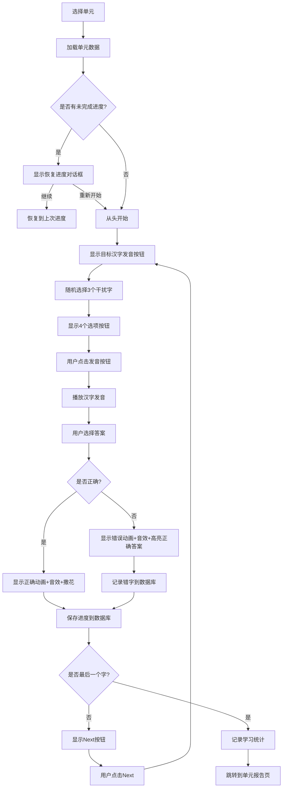

# Sophia 中文识字测试 Web 应用设计文档

> 版本：1.1  
> 更新日期：2026-03-11  
> 项目名称：汉字小达人

---

## 1. 项目概述

### 1.1 项目背景
为孩子 Sophia 巩固中文识字能力，开发一款游戏化的识字测试 Web 应用。通过听音选字的方式，让孩子在趣味互动中学习和复习汉字。

### 1.2 目标用户
- 主要用户：4-10 岁儿童（以 Sophia 为主）
- 管理用户：家长或教师

### 1.3 核心价值
- **游戏化学习**：通过发音识别、即时反馈、成就系统激发学习兴趣
- **个性化进度**：按阶段、按单元推进，记录每个孩子的学习轨迹
- **错字追踪**：自动记录错字，支持针对性复习
- **学习激励**：连续学习天数统计，激励持续学习

---

## 2. 功能需求

### 2.1 用户端功能

| 功能模块 | 描述 | 状态 |
|---------|------|------|
| **用户登录** | 输入用户名即可登录，系统自动检查有效期 | ✅ 已完成 |
| **阶段选择** | 展示 4 个学习阶段，显示每个阶段的完成进度 | ✅ 已完成 |
| **单元选择** | 以网格形式展示当前阶段的所有单元，显示完成状态 | ✅ 已完成 |
| **识字练习** | 目标汉字发音 + 4 个选项（1 目标 + 3 干扰），选择后即时反馈 | ✅ 已完成 |
| **音效反馈** | 正确/错误时播放音效 | ✅ 已完成 |
| **撒花动画** | 答对时显示撒花效果 | ✅ 已完成 |
| **断点续练** | 中途退出后可恢复进度 | ✅ 已完成 |
| **单元报告** | 完成一个单元后显示得分、正确率、错字列表 | ✅ 已完成 |
| **错题本** | 按单元分组展示所有错字，支持错题练习 | ✅ 已完成 |
| **学习统计** | 连续学习天数、总学习天数、完成单元数统计 | ✅ 已完成 |

### 2.2 管理端功能

| 功能模块 | 描述 | 状态 |
|---------|------|------|
| **管理入口** | 通过简单密码保护的管理后台入口 | ✅ 已完成 |
| **用户管理** | 添加/编辑/删除用户，设置用户名和有效期 | ✅ 已完成 |
| **期限控制** | 过期用户无法使用，显示续期提示 | ✅ 已完成 |

### 2.3 用户故事

```
作为一个孩子，
我想要 通过听发音来选择正确的汉字，
以便于 在游戏中学习和巩固识字能力。

作为一个家长，
我想要 查看孩子的学习进度和错字记录，
以便于 了解孩子的学习情况并针对性辅导。

作为一个管理员，
我想要 管理多个用户的学习权限，
以便于 控制不同孩子的使用期限。
```

---

## 3. 数据设计

### 3.1 字表数据结构

应用包含 2000 个汉字，分为 4 个阶段：

| 阶段 | 字数 | 单元数 | 说明 |
|-----|------|--------|------|
| 第一阶段 | 1200 字 | 60 单元 | 基础识字（日常高频 + 兴趣领域） |
| 第二阶段 | 300 字 | 15 单元 | 阅读拓展（累计 1500 字） |
| 第三阶段 | 300 字 | 15 单元 | 表达深化（累计 1800 字） |
| 第四阶段 | 200 字 | 10 单元 | 综合提升（累计 2000 字） |

**单元划分规则**：
- 每个阶段的所有汉字打乱后，按每 20 字划分为一个单元
- 单元内汉字按打乱后的顺序排列
- 每个单元的汉字在练习时按顺序展示

### 3.2 数据库表结构

#### 3.2.1 用户表 (users)

```sql
CREATE TABLE users (
  id UUID PRIMARY KEY DEFAULT gen_random_uuid(),
  username VARCHAR(50) UNIQUE NOT NULL,
  expire_at TIMESTAMPTZ,           -- 有效期截止时间
  created_at TIMESTAMPTZ DEFAULT NOW(),
  is_active BOOLEAN DEFAULT TRUE
);

CREATE INDEX idx_users_username ON users(username);
```

#### 3.2.2 单元进度表 (unit_progress)

```sql
CREATE TABLE unit_progress (
  id UUID PRIMARY KEY DEFAULT gen_random_uuid(),
  user_id UUID REFERENCES users(id) ON DELETE CASCADE,
  stage INT NOT NULL CHECK (stage BETWEEN 1 AND 4),
  unit INT NOT NULL CHECK (unit >= 1),
  current_index INT DEFAULT 0,     -- 当前练习到第几个字（用于断点续练）
  completed BOOLEAN DEFAULT FALSE,
  score INT DEFAULT 0,             -- 正确数量
  total INT DEFAULT 20,            -- 总字数
  wrong_chars TEXT[] DEFAULT '{}', -- 错字列表
  completed_at TIMESTAMPTZ,
  UNIQUE(user_id, stage, unit)
);

CREATE INDEX idx_unit_progress_user ON unit_progress(user_id);
CREATE INDEX idx_unit_progress_user_stage ON unit_progress(user_id, stage);
```

#### 3.2.3 错字记录表 (wrong_chars)

```sql
CREATE TABLE wrong_chars (
  id UUID PRIMARY KEY DEFAULT gen_random_uuid(),
  user_id UUID REFERENCES users(id) ON DELETE CASCADE,
  char CHAR(1) NOT NULL,
  stage INT NOT NULL,
  unit INT NOT NULL,
  wrong_count INT DEFAULT 1,       -- 累计错误次数
  last_wrong_at TIMESTAMPTZ DEFAULT NOW(),
  UNIQUE(user_id, char)
);

CREATE INDEX idx_wrong_chars_user ON wrong_chars(user_id);
CREATE INDEX idx_wrong_chars_user_stage_unit ON wrong_chars(user_id, stage, unit);
```

#### 3.2.4 学习记录表 (study_records)

用于统计连续学习天数：

```sql
CREATE TABLE study_records (
  id UUID PRIMARY KEY DEFAULT gen_random_uuid(),
  user_id UUID REFERENCES users(id) ON DELETE CASCADE,
  study_date DATE NOT NULL,       -- 学习日期
  units_completed INT DEFAULT 1,  -- 当天完成的单元数
  created_at TIMESTAMPTZ DEFAULT NOW(),
  UNIQUE(user_id, study_date)
);

CREATE INDEX idx_study_records_user ON study_records(user_id);
CREATE INDEX idx_study_records_date ON study_records(study_date);
```

#### 3.2.5 管理员配置表 (admin_config)

```sql
CREATE TABLE admin_config (
  id INT PRIMARY KEY DEFAULT 1,
  password_hash VARCHAR(255) NOT NULL  -- 存储密码的哈希值
);
```

### 3.3 数据文件结构

字表数据存储为 JSON 文件，格式如下：

```json
// data/stage1.json
{
  "stage": 1,
  "totalChars": 1200,
  "totalUnits": 60,
  "units": [
    {
      "unit": 1,
      "chars": ["字1", "字2", "字3", ...]  // 20个字
    },
    {
      "unit": 2,
      "chars": ["字21", "字22", ...]
    }
    // ... 共60个单元
  ]
}
```

---

## 4. 技术架构

### 4.1 技术栈

| 层级 | 技术选型 | 说明 |
|-----|---------|------|
| 前端框架 | Next.js 14 (App Router) | React 全栈框架，支持 SSR |
| 开发语言 | TypeScript | 类型安全 |
| 样式方案 | Tailwind CSS | 原子化 CSS |
| 动画库 | Framer Motion | 流畅的交互动画 |
| 数据库 | Supabase (PostgreSQL) | 开源 BaaS，支持实时订阅 |
| 状态管理 | Zustand | 轻量级状态管理 |
| 语音合成 | Web Speech API | 浏览器原生语音合成 |
| 部署平台 | Vercel | 与 Next.js 无缝集成 |

### 4.2 系统架构图

```
┌─────────────────────────────────────────────────────────────┐
│                        用户界面层                            │
│  ┌─────────┐ ┌─────────┐ ┌─────────┐ ┌─────────┐ ┌────────┐ │
│  │ 登录页  │ │阶段选择 │ │单元选择 │ │ 练习页  │ │错题本  │ │
│  └─────────┘ └─────────┘ └─────────┘ └─────────┘ └────────┘ │
└─────────────────────────────────────────────────────────────┘
                              │
                              ▼
┌─────────────────────────────────────────────────────────────┐
│                        业务逻辑层                            │
│  ┌─────────────┐ ┌─────────────┐ ┌─────────────────────┐    │
│  │ useAuth     │ │ useProgress │ │ useSpeech           │    │
│  │ (认证状态)  │ │ (进度管理)  │ │ (语音合成)          │    │
│  └─────────────┘ └─────────────┘ └─────────────────────┘    │
└─────────────────────────────────────────────────────────────┘
                              │
                              ▼
┌─────────────────────────────────────────────────────────────┐
│                        数据访问层                            │
│  ┌───────────────────────────────────────────────────────┐  │
│  │ Supabase Client                                        │  │
│  │ - 用户认证 (users CRUD)                                │  │
│  │ - 进度同步 (unit_progress CRUD)                        │  │
│  │ - 错字记录 (wrong_chars CRUD)                          │  │
│  │ - 学习统计 (study_records CRUD)                        │  │
│  └───────────────────────────────────────────────────────┘  │
└─────────────────────────────────────────────────────────────┘
                              │
                              ▼
┌─────────────────────────────────────────────────────────────┐
│                        数据存储层                            │
│  ┌─────────────────┐  ┌─────────────────────────────────┐  │
│  │ JSON 文件       │  │ Supabase PostgreSQL             │  │
│  │ (字表数据)      │  │ (用户数据 + 进度 + 错字 + 统计)  │  │
│  └─────────────────┘  └─────────────────────────────────┘  │
└─────────────────────────────────────────────────────────────┘
```

### 4.3 目录结构

```
literacy-test/
├── src/
│   ├── app/                          # Next.js App Router
│   │   ├── layout.tsx                # 根布局
│   │   ├── page.tsx                  # 首页/登录页
│   │   ├── stages/
│   │   │   ├── page.tsx              # 阶段选择页
│   │   │   └── [stage]/
│   │   │       ├── page.tsx          # 单元选择页
│   │   │       └── part/[part]/
│   │   │           └── page.tsx      # 子部分选择页（第一阶段）
│   │   ├── quiz/
│   │   │   └── [stage]/[unit]/
│   │   │       └── page.tsx          # 练习页面
│   │   ├── wrong-quiz/
│   │   │   └── [stage]/[unit]/
│   │   │       └── page.tsx          # 错题练习页面
│   │   ├── report/
│   │   │   └── [stage]/[unit]/
│   │   │       └── page.tsx          # 单元报告页
│   │   ├── wrong-book/
│   │   │   └── page.tsx              # 错题本页
│   │   └── admin/
│   │       ├── page.tsx              # 管理后台登录
│   │       └── dashboard/
│   │           └── page.tsx          # 用户管理面板
│   ├── components/
│   │   ├── ui/                       # 基础 UI 组件
│   │   ├── quiz/                     # 练习相关组件
│   │   │   ├── QuizCard.tsx          # 练习卡片（含音效、撒花）
│   │   │   ├── CharButton.tsx        # 汉字选项按钮
│   │   │   ├── SpeakerButton.tsx     # 发音按钮
│   │   │   └── FeedbackOverlay.tsx   # 撒花动画
│   │   ├── stages/                   # 阶段选择组件
│   │   └── layout/                   # 布局组件
│   ├── lib/
│   │   ├── supabase/
│   │   │   ├── client.ts             # Supabase 客户端
│   │   │   ├── auth.ts               # 认证相关
│   │   │   ├── users.ts              # 用户操作
│   │   │   ├── progress.ts           # 进度操作
│   │   │   ├── wrong-chars.ts        # 错字操作
│   │   │   └── study-records.ts      # 学习记录操作
│   │   ├── speech/
│   │   │   └── tts.ts                # Web Speech API 封装
│   │   └── utils/
│   │       ├── shuffle.ts            # 随机打乱算法
│   │       └── sounds.ts             # 音效工具
│   ├── data/
│   │   ├── stage1.json               # 第一阶段字表
│   │   ├── stage2.json
│   │   ├── stage3.json
│   │   └── stage4.json
│   ├── store/
│   │   └── useStore.ts               # Zustand 全局状态
│   └── types/
│       └── index.ts                  # 类型定义
├── supabase/
│   └── migrations/
│       └── 001_initial_schema.sql    # 数据库初始化脚本
├── public/
│   └── sounds/                       # 音效文件
├── .env.local                        # 环境变量
├── next.config.js
├── tailwind.config.js
├── tsconfig.json
├── DESIGN.md
└── README.md
```

---

## 5. 页面设计

### 5.1 设计风格

- **整体风格**：卡通可爱风格，色彩鲜艳、圆润友好
- **配色方案**：
  - 主色调：#FF6B6B（珊瑚红）、#4ECDC4（青绿）、#FFE66D（明黄）
  - 背景色：#FFF9F0（暖白）、#FFFFFF、#F8F9FA
  - 功能色：#00B894（成功绿）、#E17055（警告橙）

### 5.2 页面规划

#### 5.2.1 登录页
- 标题：汉字小达人
- 输入框：请输入你的名字
- 开始学习按钮

#### 5.2.2 阶段选择页
- 顶部：欢迎信息 + 学习统计卡片（连续天数、总天数、完成单元）
- 中部：4个阶段卡片（显示完成进度）
- 底部：错题本入口按钮

#### 5.2.3 单元选择页
- 顶部：返回按钮 + 阶段标题
- 中部：单元网格（已完成绿色+星星、进行中蓝色边框、未开始灰色）

#### 5.2.4 练习页面（核心）
- 顶部：返回按钮 + 进度条
- 中部：发音按钮 + 4个汉字选项
- 底部：下一题按钮
- 反馈：答对撒花动画 + 音效、答错高亮正确答案 + 音效

#### 5.2.5 单元报告页
- 恭喜完成动画
- 得分和正确率
- 需要复习的字列表
- 返回列表/再练一次按钮

#### 5.2.6 错题本页
- 顶部：返回按钮 + 错题本标题 + 错字总数
- 中部：按阶段/单元分组展示错字
- 每个错字显示错误次数
- 点击进入错题练习

#### 5.2.7 管理后台
- 密码验证入口
- 用户列表管理
- 添加/编辑用户（用户名、有效期）

---

## 6. 核心流程

### 6.1 用户登录流程

```mermaid
flowchart TD
    A[用户输入用户名] --> B{用户是否存在?}
    B -->|否| C[显示"用户不存在"]
    B -->|是| D{是否过期?}
    D -->|是| E[显示"已过期,请联系家长续期"]
    D -->|否| F[存储用户信息到本地]
    F --> G[跳转到阶段选择页]
```

### 6.2 练习流程



### 6.3 数据同步策略

- **进度保存时机**：
  1. 每次答题后（正确/错误）
  2. 单元完成后
- **本地缓存**：
  - 使用 Zustand 持久化存储当前会话状态
  - 页面刷新后可恢复进度

---

## 7. API 设计

### 7.1 Supabase 数据操作

#### 用户相关
- `getUserByUsername(username)` - 根据用户名查询用户
- `createUser(username, expireAt)` - 创建新用户
- `updateUser(id, updates)` - 更新用户信息
- `deleteUser(id)` - 删除用户

#### 进度相关
- `getUserProgress(userId)` - 获取用户所有单元进度
- `getUnitProgress(userId, stage, unit)` - 获取单个单元进度
- `saveUnitProgress(progress)` - 保存单元进度
- `updateUnitProgress(userId, stage, unit, updates)` - 更新单元进度

#### 错字相关
- `recordWrongChar(userId, char, stage, unit)` - 记录错字
- `getUserWrongChars(userId)` - 获取用户所有错字
- `getWrongCharsByStageUnit(userId, stage, unit)` - 获取指定单元的错字
- `deleteWrongChar(userId, char)` - 删除错字记录

#### 学习统计相关
- `recordStudy(userId)` - 记录今日学习
- `getStreakDays(userId)` - 获取连续学习天数
- `getStudyStats(userId)` - 获取学习统计数据

---

## 8. 语音合成实现

### 8.1 Web Speech API 封装

```typescript
// lib/speech/tts.ts

export const speak = (text: string): Promise<void> => {
  return new Promise((resolve, reject) => {
    if (!('speechSynthesis' in window)) {
      reject(new Error('浏览器不支持语音合成'));
      return;
    }

    const utterance = new SpeechSynthesisUtterance(text);
    
    // 设置中文语音
    utterance.lang = 'zh-CN';
    utterance.rate = 0.8;  // 稍慢，适合儿童
    utterance.pitch = 1.1; // 稍高，更活泼
    
    // 尝试使用中文语音
    const voices = speechSynthesis.getVoices();
    const chineseVoice = voices.find(v => v.lang.includes('zh'));
    if (chineseVoice) {
      utterance.voice = chineseVoice;
    }

    utterance.onend = () => resolve();
    utterance.onerror = (e) => reject(e);

    speechSynthesis.speak(utterance);
  });
};

export const preloadVoices = () => {
  if ('speechSynthesis' in window) {
    speechSynthesis.getVoices();
  }
};
```

---

## 9. 部署方案

### 9.1 环境变量

```env
# .env.local
NEXT_PUBLIC_SUPABASE_URL=your_supabase_url
NEXT_PUBLIC_SUPABASE_ANON_KEY=your_supabase_anon_key
SUPABASE_SERVICE_ROLE_KEY=your_service_role_key  # 仅服务端使用
ADMIN_PASSWORD_HASH=your_password_hash  # 管理后台密码
```

### 9.2 部署步骤

1. **创建 GitHub 仓库**
   ```bash
   git init
   git add .
   git commit -m "Initial commit"
   git branch -M main
   git remote add origin https://github.com/username/literacy-test.git
   git push -u origin main
   ```

2. **配置 Supabase**
   - 创建 Supabase 项目
   - 执行数据库迁移脚本
   - 配置 RLS 策略
   - 获取 API 密钥

3. **部署到 Vercel**
   - 连接 GitHub 仓库
   - 配置环境变量
   - 自动部署

---

## 10. 后续优化

### 10.1 已完成优化

- [x] 添加音效反馈（正确/错误音效）
- [x] 实现学习连续天数记录
- [x] 支持错字专项练习
- [x] 断点续练功能

### 10.2 待完成优化

- [ ] 添加成就徽章系统
- [ ] 接入更高质量的语音合成服务
- [ ] 支持自定义字表
- [ ] 添加家长端小程序
- [ ] 支持学习报告导出

---

## 附录

### A. 数据库迁移脚本

详见：`supabase/migrations/001_initial_schema.sql`

### B. 字表数据文件

详见：`src/data/stage1.json` ~ `src/data/stage4.json`

### C. 参考资源

- [Next.js 文档](https://nextjs.org/docs)
- [Supabase 文档](https://supabase.com/docs)
- [Web Speech API](https://developer.mozilla.org/en-US/docs/Web/API/Web_Speech_API)
- [Tailwind CSS](https://tailwindcss.com/docs)
- [Framer Motion](https://www.framer.com/motion/)
